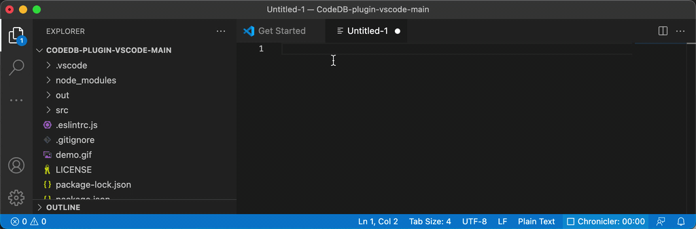

# CodeDB Plugin

This is the CodeDB plugin which allows you to use your favourite code snippets directly in Visual Studio Code.
Just type in the first characters of the shortcut, choose it from the suggestions and press enter to paste in the code snippet.

 //TODO replace gif

# Preparations
- you need an CodeDB Account. You can create one at https://codedb.de
- you will be asked for your CodeDB plugin token, you can find it when you logged in under: https://codedb.de/profile 
